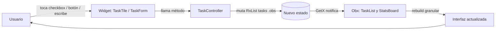

# TaskFlow — Grupo 5 (GetX)

Gestor de tareas para el **Laboratorio: Manejo de Estado en Flutter**
(IF0009 – Desarrollo de Software IV · UCR Sede del Sur).

Este repositorio arranca con el **plan de trabajo repartido estilo Jira**. La
aplicación Flutter la desarrolla el grupo siguiendo ese plan.

## Documento de reparto

- [`docs/TaskFlow-Reparto-Jira-Grupo5-GetX.pdf`](docs/TaskFlow-Reparto-Jira-Grupo5-GetX.pdf)

Contiene: la épica, 6 historias de usuario (una por integrante), sub-tareas,
criterios de aceptación, story points, estrategia de ramas, tablero Jira,
Definición de Terminado, comandos de Git y el mapa del flujo de estado con GetX.

## Reparto rápido

| ID | Integrante | Historia | Rama |
|----|-----------|----------|------|
| TF-1 | Dev 1 | Base del proyecto + modelo `Task` + tema `GetMaterialApp` | `feature/setup-modelo` |
| TF-2 | Dev 2 | `TaskController`: lista observable y lógica de negocio | `feature/task-controller` |
| TF-3 | Dev 3 | Formulario para registrar una tarea | `feature/formulario-registro` |
| TF-4 | Dev 4 | Lista reactiva + fila con checkbox y eliminar | `feature/lista-tareas` |
| TF-5 | Dev 5 | Tablero de estadísticas (total / pendientes / completadas) | `feature/tablero-stats` |
| TF-6 | Dev 6 | Integración, `Binding`, pantalla, README y diagrama | `feature/integracion-docs` |

> Reemplazar `Dev 1..6` por los nombres reales del grupo.

## Orden de integración

`TF-1` → `TF-2` → `TF-3` / `TF-4` / `TF-5` (en paralelo) → `TF-6`

## Flujo de estado (GetX)

